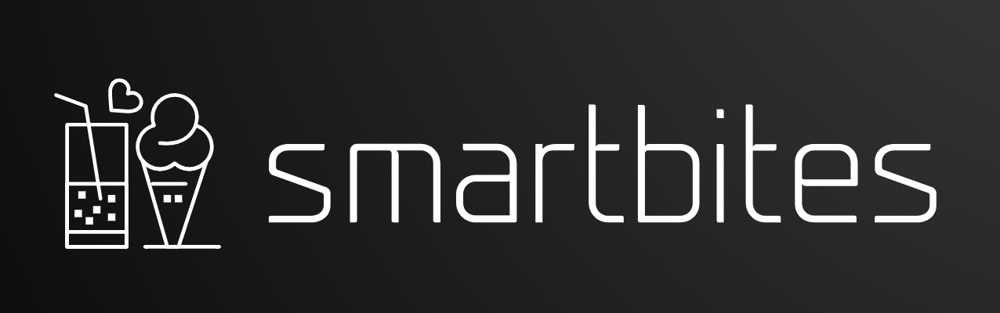

# Smart Bites - Nutritional Information Web Application

Smart Bites is a web application that allows users to access nutritional information for various food items. It helps users make healthier food choices by providing details such as calories, diet labels, health labels, and cautions associated with a specific food item.

## Table of Contents

- [Introduction](#introduction)
- [Features](#features)
- [Technologies Used](#technologies-used)
- [Getting Started](#getting-started)
- [Usage](#usage)
- [Contributing](#contributing)
- [License](#license)

## Introduction

Smart Bites is a nutritional information application powered by the Edamam API. It allows users to input a food item and retrieves its nutritional data from the API. The application is built using modern web technologies and follows a client-server architecture.

## Features

- Input a food item and fetch its nutritional data.
- Display nutritional information in a user-friendly and visually appealing manner.
- Supports a variety of diet labels and health labels for informed food choices.
- Provides cautions for specific food items based on user preferences.
- Built with responsive design to ensure a seamless experience on various devices.

## Technologies Used

- HTML5, CSS3 for the frontend user interface.
- JavaScript for client-side interactivity and API communication.
- Node.js for serverless functions (Netlify Lambda functions).
- Axios for making API requests.
- Netlify for hosting and deployment.

## Getting Started

To run Smart Bites locally, follow these steps:

1. Clone this repository to your local machine.
2. Install the required dependencies using `npm install`.
3. Set up the environment variables for the Edamam API credentials (`EDAMAM_APP_ID` and `EDAMAM_APP_KEY`) in your Netlify environment or locally.

## Usage

1. Access the live Smart Bites application [here](https://main--jolly-crostata-968cd1.netlify.app/).
2. Enter the name of a food item in the input field and click "Get Nutrition Data."
3. The application will fetch the nutritional data for the provided food item and display it in a visually appealing format.
4. Make healthier food choices based on the displayed information.

## Contributing

We welcome contributions to enhance Smart Bites. If you find a bug, have a feature request, or want to contribute improvements, feel free to open an issue or create a pull request.

1. Fork this repository.
2. Create a new branch with a descriptive name (`git checkout -b feature/my-awesome-feature`).
3. Commit your changes (`git commit -m 'Add some feature'`).
4. Push the branch to your forked repository (`git push origin feature/my-awesome-feature`).
5. Create a pull request on the original repository.

## License

This project is licensed under the [ISC License](LICENSE.md).

---

We hope you find Smart Bites helpful for making healthier food choices! If you have any questions or need assistance, feel free to reach out.

_Victor Ejiasi_  
_victorejiasi@yahoo.com_  
_www.polymorphicheroes.com_
